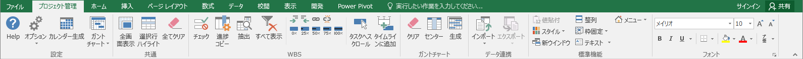
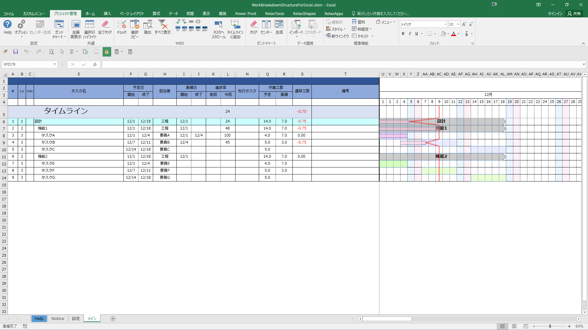
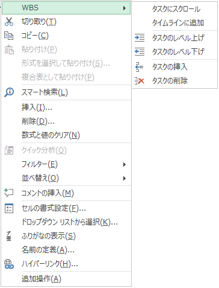

# Work Breakdown Structure for Excel

-0078D6.svg?logo=windows&style=flat)
-217346.svg?logo=microsoft-excel&style=flat)

## 動作環境
Windows 10 x64  
Microsoft Excel 2016 x86  

## 画面ショット
### リボンメニュー
  

### メイン画面
  

### 右クリックメニュー
  

## 参考サイト
[Excelでお仕事!](http://www.ne.jp/asahi/excel/inoue/)  
[moug モーグ](https://www.moug.net/)  
[Office TANAKA](http://officetanaka.net)  
[エクセルの神髄](https://excel-ubara.com/)  
[開発マイルストーン](http://zudajijp.zouri.jp/km/)  
